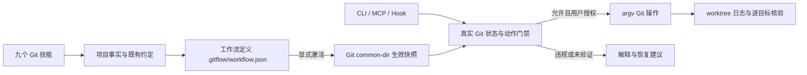

# GitFlow

让 AI 按项目约定使用 Git：进入项目先识别管理状态与规则，提交前校验角色，创建分支检查基线，发布逐目标记录回灌。当前版本 0.1.0，Python 3.11+、Git 2.41+、macOS/Linux，无运行时第三方依赖。

九技能来自独立 git-skills 包；插件内是锁定副本。可移植根 plugin.json/mcp.json 遵循 Agent Plugins 1.0.0。Claude/Codex/ZCode 清单是宿主兼容产物；本次未安装到宿主，不能据此宣称宿主自动加载、事件格式或持久化目录已经验收。



## 本地使用

从任意工作目录调用真实插件绝对路径；以下 PROJECT 代表实际项目目录。查询与预览不会初始化项目。

```text
python3 /absolute/gitflow-plugin/scripts/gitflow.py discover PROJECT --json
python3 /absolute/gitflow-plugin/scripts/gitflow.py init PROJECT --profile classic-gitflow --json
python3 /absolute/gitflow-plugin/scripts/gitflow.py audit PROJECT --json
python3 /absolute/gitflow-plugin/scripts/gitflow.py gate PROJECT --action commit --message "feat: 登录" --json
```

得到用户当前范围内授权后，受管变更追加 --apply。无 Git 的项目必须同时明确 --initialize-git 才执行 git init；空历史不自动造初始提交与分支。已有历史需明确 profile 或现有定义，init 不能覆盖已生效规范。

| 命令 | 操作与关键参数 |
|---|---|
| discover | 真实根、Git/common/worktree、HEAD/dirty/中断、本地 refs |
| init | --profile MODEL --mode shared/local；--initialize-git；--apply |
| policy | --operation activate；候选变更显式激活；--apply |
| audit | 长期覆盖、命名与来源未知、规范漂移、远端/保护未验证 |
| gate | --action commit/push/pull/merge/rebase；--source/--target/--message |
| branch | --operation create/switch/rename/delete/reconcile；--name/--source/--target |
| sync | --operation fetch/pull/push/merge/rebase；--remote/--source/--target |
| release | --operation start/finish/backport；--name/--source/--targets/--commit |
| recovery | --operation diagnose/resume/move-changes/move-commit/backport/abort/continue；resume 确认需 --operation-id |
| context | 无 Git 选择 --choice defer/initialize/clear；--apply；需要 PLUGIN_DATA |
| hooks | 预览/--apply 安装本地原生 commit-msg/pre-push；不覆盖已有 Hook |
| mcp | JSON 行 stdio；11 个有闭合参数的工具 |
| hook | --event SessionStart/UserPromptSubmit/PreToolUse/PostToolUse/Stop；从 stdin 读宿主 JSON |

退出码 0 仅表示本动作允许、预览或完成；1 明确违规；2 用法错误；3 未验证；4 内部错误。所有动作结果都有 schema_version/action/decision/reasons/next_actions。gate 的 quality_decision 为 not_evaluated；质量由 CodeGuard 或项目验证另行承担。

## 项目规范与存储

共享定义是 .gitflow/workflow.json，Markdown 是生成说明；建议随正常代码交付版本化。Git common-dir/gitflow/activation.json 保存确认快照与摘要；origins.json 保存插件创建来源；当前 Git dir/gitflow/journal.json 保存当前 worktree 操作步骤。绝不拼接项目 .git 作为唯一目录。local 模式只存元数据，不随 clone 分发。

规则支持闭合的角色、命名、长期覆盖、允许提交、创建来源、合入目标、合并与消息策略、主远端和协作模式。候选变更不会直接弱化门禁，激活时修订递增。例外必须通过明确候选修订；没有临时 --no-verify 参数。用户可直接改 Git 元数据或禁用 Hook，因此这不是对拥有本机写权限用户的安全隔离。

八模板及来源见 profiles/、sources.json。Fork 作为独立协作模式；模板命名、main 映射和保护为项目约定。trunk-based 是受审查短分支变体，分支寿命/数量是协作目标，首版不声称已自动度量。Git-maintainer 与 Microsoft 传播方向分别建模。

## 操作边界

create 不自动 switch；dirty 或其他 worktree 占用时拒绝普通切换。清理不能强制删除未合入分支。pull 使用 fetch+ff-only；push 仅支持同名单分支，不执行 force/mirror/delete。rebase 拒绝已有本地远端引用包含的提交；远端是否公开还需要用户/实时事实确认。squash 配置可表达，但执行返回未验证，需独立提交方案。

release finish 按全部目标集成，活跃 release 纳入 classic hotfix 回灌；冲突时保留真实目标和未完成列表。无自动推送、发布标签、删除源分支或部署。recovery 保留错分支原引用，复制单父提交；resume 观察日志与实际状态，不盲重放未知步骤；选择 --operation-id 并 --apply 时，只在祖先、等价补丁、创建来源或实际远端引用可证明完成后确认日志。无法证明的 fetch/pull/rebase 等仍返回未验证。互斥只约束本插件协作进程，外部 Git 仍可能修改仓库，apply 前重新核验身份。

默认 classic 空仓的 main 日常提交受保护，首次提交需单独确认初始范围与 bootstrap 策略。本版本可通过明确候选修订临时允许初始提交，激活→首提交→恢复保护→reconcile；不会擅自放宽 main。

## Hook 与宿主

根 hooks/hooks.json 提供 Claude-shape 事件。PreToolUse 识别 git -C、简单 cd && 链及明确受管动作；动态 shell、未知全局配置/alias、强推等返回 ask/deny。Hook 不执行输入命令，不能约束任意脚本内的 Git、未经过该宿主的终端或服务端行为。现有原生 Hook 不被覆盖，已有 core.hooksPath 应通过原管理器接线。原生 commit-msg 按 journal/OID/修订识别受管集成；pre-push 拒绝会重写远端历史的非快进操作。它无法观察任意原始 argv；强制选项即使不改变历史也需宿主层审查。原生 merge/rebase/pull/fetch 的配置和短 ref 语义不与插件计划等同时，PreToolUse 返回未验证并引导使用 sync。

可移植客户端从 mcp.json 启动 python3，并提供 PLUGIN_ROOT/PLUGIN_DATA；CLI 不要求安装成全局命令。宿主未提供 PLUGIN_DATA 时无 Git 选择仍可在会话保留，持久化操作返回未验证。持久决定不是未来写 Git 的授权。

## 验证与分发

```text
python3 -m unittest discover -s tests -p "test_*.py"
python3 scripts/validate_package.py
python3 scripts/vendor_skills.py --check
python3 scripts/package.py --output /absolute/output/gitflow-0.1.0.zip
```

validator 使用标准库核对结构、路径、版本、技能与模板摘要；开发时另用已存在的 jsonschema 验证官方 schema。发布前更新独立技能包再显式 vendor；仓库目录没有 Git 初始化或远端，不运行提交、推送、安装。

[规格与验收](docs/superpowers/specs/2026-10-07-gitflow.md)；[验证报告](docs/verification.md)。真实临时本地/bare 远端测试与宿主安装、托管保护、CI、生产发布是不同证据。
