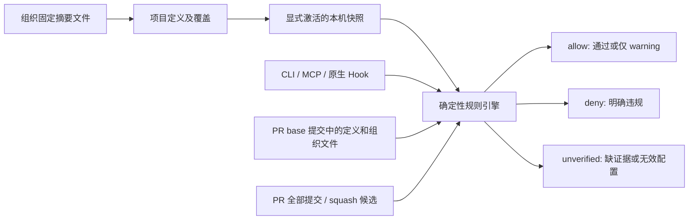

# 规则、PR 检查与组织基线（0.2.0）

## 一个事实源，多个检查入口

共享定义仍是 `.gitflow/workflow.json`，本机状态仍是 `.gitflow/state/`。v1 定义和模板保持原行为；不会自动启用 Conventional Commits。v2 在完整 v1 定义上将 `schema_version` 改为 `2.0.0`，增加必需的 `rules` 和 `extends`（未继承时为 null）。可参考 [完整示例](../examples/workflow-v2.json)。修改后先预览 `policy`，在已有授权范围内追加 `--apply` 激活。



## 规则目录

| ID | 规则 | 参数与默认值 |
|---|---|---|
| GF001 | Conventional Commits | types: feat/fix/docs/style/refactor/perf/test/build/ci/chore/revert；allow_merge: true |
| GF002 | 标题字符数 | min_length: 1；max_length: 72；长度按 Unicode 字符计数 |
| GF101 | 真实作者名称 | pattern：非空且不含换行及尖括号 |
| GF102 | 真实作者邮箱 | pattern：非空地址包含一个 @，不含空白 |
| GF103 | 作者 Signed-off-by | 无参数；尾部 trailer 必须与实际作者名称、邮箱一致 |
| GF104 | AI 辅助声明 | mode: ignore / forbid / disclose；默认 ignore |
| GF401 | 指向被检 head 的标签格式 | pattern 默认匹配 v数字.数字.数字 |

每项配置必须有 `severity: off|warn|error`，可选 `options`。未配置规则为 off；未知 ID、额外字段、非法类型或正则都返回 unverified，off 也不能掩盖错误。自定义正则沿用受限表达式：最长 240 字符，禁止前后查找、反向引用、分组量词、计数量词和多重无界重复。内置默认表达式由运行时维护。

结果 `checks` 包含 rule_id/name/severity/status/actual/expected/message/suggestion/fix。status 为 pass/fail/skipped/unverified。warn 的已知失败不阻断；未知元数据仍是未验证。分支保护、创建来源、合并方向、仓库身份和中断状态不属于可关闭的格式规则。

`Fix: 修复` 可确定修正为 `fix: 修复`；没有类型或标题过长时只建议，不猜测类型或截断语义。所有 fix 都是返回值，不会改文件、amend 或提交。

GF103 是声明一致性检查，不验证 GPG/SSH 签名。GF104 仅识别声明中的已知工具，不检测代码是否由 AI 生成；forbid 禁止识别到的 AI 署名，disclose 要求 Assisted-by，且不能将识别到的 AI 放入作者/签署 trailer。正文中的同名文字不算尾部声明。

## CLI、MCP 与 Hook

以下命令使用当前插件实际绝对路径，不假定全局命令已安装：

```text
python3 /absolute/gitflow-plugin/scripts/gitflow.py policy PROJECT --operation describe
python3 /absolute/gitflow-plugin/scripts/gitflow.py doctor PROJECT
python3 /absolute/gitflow-plugin/scripts/gitflow.py gate PROJECT --action commit --message "Fix: 修复"
python3 /absolute/gitflow-plugin/scripts/gitflow.py check PROJECT --base FULL_BASE_OID --head FULL_HEAD_OID --source feature/task --target main
```

MCP 对应 gitflow_rules、gitflow_doctor、gitflow_check；参数语义与 CLI 一致。gitflow_organization 显式 apply 时可联网，查询工具不联网。原生 commit-msg 使用同一引擎；受管集成提交仍需日志身份验证，不能借 merge 绕过元数据规则。已有原生运行时不会偷偷替换，doctor 会报告 outdated；由用户审查升级接线。

## PR/CI 的可信输入

[业务仓库工作流示例](../examples/github-pr.yml) 使用发布 Action 的引擎，不执行 PR 中的插件脚本。示例默认逐提交检查，可将 message-mode 改成 squash；squash 候选取 PR 标题和正文，并继续逐提交检查真实作者。PR 文案不保证等于平台最终 squash 消息，应配合 required check 与合并设置。若启用 GF103，候选作者未知会返回 unverified，不冒用某个提交作者。

检查读取完整 base/head OID，范围是 base..head，最多 500 条；不自动 fetch。浅克隆、缺对象、无共同历史、超预算、缺 base 规则均返回 unverified。策略和组织基线只从 base 提交读取，忽略 head 中削弱规则的修改及本机 activation。首次接入须先在目标分支提交定义，再要求 PR 检查。

CI 验证声明的源/目标分支角色与合并方向；merge-base 不证明创建来源。标签只检查本地已获取、指向 head 的标签；未获取的远端标签不在结论范围。不能据此声称服务端保护生效。Action 生成 JSON 和转义后的 job summary；退出码 0/1/3 对应 allow/deny/unverified。需覆盖 merge queue 时另行设计明确 base/head 事件适配，当前 Action 仅支持 pull_request。

## 固定组织基线

组织文件只有 schema_version=1.0.0、rules、locked_rules 三个字段；不支持递归继承。项目按规则 ID 整项覆盖未锁定配置；锁定项只能省略或写完全相同的配置。分支角色仍由项目工作流定义。

```json
{"schema_version":"1.0.0","rules":{"GF001":{"severity":"error"}},"locked_rules":["GF001"]}
```

```text
python3 /absolute/gitflow-plugin/scripts/gitflow.py organization PROJECT --source /absolute/team.json --name team --sha256 EXPECTED_SHA256
python3 /absolute/gitflow-plugin/scripts/gitflow.py organization PROJECT --source /absolute/team.json --name team --sha256 EXPECTED_SHA256 --apply
```

来源可以是本地文件或 HTTPS。预览不联网、不建文件；apply 有界读取并验证预期摘要和结构，再排他写入 `.gitflow/baselines/team.json`。已有不同文件不覆盖。可信摘要必须来自你认可的渠道，不能把未经核对的下载结果当信任建立。导入不自动激活。

在 v2 定义中设置 `extends: {"path":".gitflow/baselines/team.json","sha256":"预期64位摘要"}`，审查后执行 policy --apply。共享模式候选或基线漂移不会放宽生效规则；本机 local 模式保留已激活的完整有效快照。组织不可达不影响离线检查，缺失或损坏已引用文件不能降级为通过。

## 诊断与验收边界

doctor 观察原生 Hook 内容、运行时版本和 CI 配置线索。文件存在只表示 configured/configured_unverified，不表示执行成功；MCP 宿主与服务端分支保护保持 unverified。插件没有安装到用户宿主，没有自动设置 GitHub required check，没有托管 GitHub App。以上能力参考 Commit Check 的统一配置/多入口思路，保留 GitFlow 的分支生命周期和显式变更边界。
