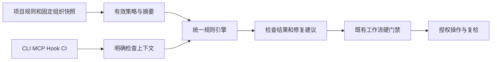

## Context

v0.1.5 为 Python 标准库 CLI/MCP/Hook；policy 顶层闭合，激活记录含 policy/mode/sha256。历史 R01–R25 保留，需求参见 proposal。无 CodeGraph 索引，因此直接阅读当前源码。不引入 commit-check 依赖，避免两套工作流事实源。

## Goals / Non-Goals

Goals：P0 规则与反馈、P1 PR/CI、P2 固定组织快照和接线诊断一次闭环。非目标见 proposal；额外不自动安装到宿主、不设置 GitHub 分支保护、不创建真实项目任务分支。

## Decisions

1. workflow 1.0.0 原样兼容；2.0.0 额外必需 rules 与 extends（可为 null），仅显式启用规则运行。每条配置为 severity 及可选 options，参数按规则闭合。规则编号不随中文文案变化；规则结果为 pass/fail/skipped/unverified，保留 CLI 既有 decision/退出码。
2. 新 rules 模块只消费元数据，返回 checks；配置/上下文未知与 error 违规分开。正则继续受限，字符串和集合限长。修复只产生建议，尚不提供自动 fix 命令。已知类型大小写可机械修正，未知语义 fix=null。
3. policy 候选在激活前合并 organization 快照；快照 policy.rules 保存有效规则，extends 保留来源摘要与路径。shared load 重算候选以检测漂移；local load 使用已确认快照，不偷偷联网。
4. organization import 从本地/HTTPS 读取受限字节（256 KiB）、核验调用者提供的 sha256 后写入不可变命名文件；网络仅显式 apply。组织 locked_rules 禁止不同项目覆盖。统一新 policy describe 入口报告来源。
5. gate 提交身份使用 git var GIT_AUTHOR_IDENT；CI 使用每条提交真实 author。native 受管集成的方向/OID 证明与元数据检查串联，merge 自动消息可显式允许。
6. check 命令接受完整 base/head OID，读取 base:.gitflow/workflow.json 与基线 blob；禁止取工作树/head 候选代替，最多 500 个提交、浅历史拒绝。提交消息模式 commits/squash，后者单独候选消息，作者仍逐提交检查。源/目标是宿主传入的 PR 名称，日志不伪造其创建来源。
7. action.yml 使用版本固定的引擎及 Python 3.11，脚本读取 event JSON；所有 Git 均 argv，摘要转义，输出在 runner 临时目录；PR 代码从不执行。提供 pull_request 最小示例，不使用 pull_request_target 执行 head。
8. doctor 只读；Hook 入口只确认已知 wrapper，未知管理器显示需接线；CI 文件只表示配置线索，宿主和托管保护必须保持 unverified。

## Risks / Trade-offs

- v2 为显式升级，旧客户端不识别 → 保留 v1，并文档说明部署次序，不自动重写用户配置。
- 组织基线文件需版本化 → 锁定摘要、只导入不激活，CI 从受信 base 读取同一 blob。
- 跨入口上下文不同 → 不适用 skipped、缺少必要证据 unverified；不能用 warning 隐藏配置错误。
- AI 工具识别只覆盖已知签名 → 说明这是声明约定，不是生成代码检测。
- GitHub 托管权限与事件接线 → 本地真实 event/Git 回放和仓库自身 CI 分层报告；不声称配置文件保证服务端强制。

## Migration Plan

先建立正式增量规格和红灯场景；实现兼容 v1 的引擎、CI 与组织快照；同步 git-skills 契约及 vendor；本地全回归、OpenSpec 严格验证、包校验；按既有授权提交推送，核对 CI 和发行身份。出现回归不覆盖旧 tag，可继续使用 v0.1.5 和 v1 项目规则。实现与验证通过后同步并归档规格。
